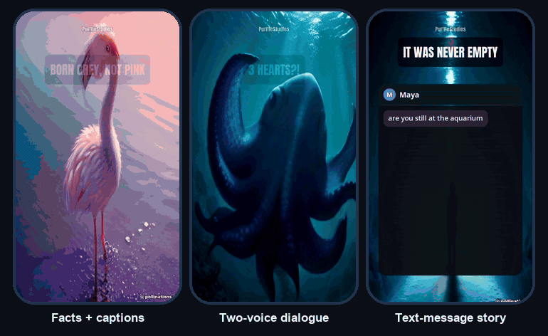

<div align="center">

# PurffleShorts — Generador gratuito de YouTube Shorts con IA y piloto automático de subidas

[English](README.md) · [简体中文](README.zh-CN.md) · **Español** · [Português](README.pt-BR.md) · [हिन्दी](README.hi.md) · [日本語](README.ja.md)

**Un generador de video con IA de código abierto para YouTube Shorts, TikTok e Instagram Reels. Dale un tema, una página web, un post de Reddit o un podcast largo y creará videos verticales terminados (guion, locución, material visual, subtítulos) que luego subirá o programará en YouTube.**

[](https://github.com/Chamanrajragu/purffle-shorts/actions/workflows/ci.yml)
[](LICENSE)
[](https://github.com/Chamanrajragu/purffle-shorts/stargazers)



<sub>Resultado real, sin editar. Voces neuronales gratuitas de Microsoft e imágenes generadas con IA. Los GIF no tienen sonido.</sub>

**Pruébalo sin claves de API y sin registrarte** (necesitas [uv](https://docs.astral.sh/uv/)):

```bash
uvx --from git+https://github.com/Chamanrajragu/purffle-shorts purffle-shorts demo --style chat
```

**⭐ Si PurffleShorts te ahorra tiempo, una estrella ayuda a que otros creadores lo encuentren.**

</div>

> Esta es una versión breve. La documentación completa (todos los ajustes, modelos de IA, voces, subtítulos, publicación, línea de comandos, Studio y solución de problemas) está en el [README en inglés](README.md).

## ¿Qué es PurffleShorts?

PurffleShorts es una herramienta de automatización de YouTube Shorts para canales sin rostro. Lo inicias y no se detiene: un tema nuevo, un guion escrito por el modelo de IA que elijas y luego revisado y afinado por una segunda pasada de IA, una locución natural con IA, material visual relevante, subtítulos sincronizados con cada palabra hablada, un renderizado pulido y una subida o una publicación programada.

También es un pequeño estudio: puedes editar cualquier línea del guion antes de renderizar, crear diálogos a dos voces, historias de mensajes de texto e historias al estilo Reddit, convertir un artículo o un post de Reddit en un Short, extraer Shorts de un podcast y publicar el mismo video en varios idiomas. Funciona en tu propio equipo (macOS, Windows, Linux o Docker), y los archivos MP4 en 9:16 también sirven para TikTok e Instagram Reels.

## Características

- **Cualquier modelo de IA:** OpenAI GPT, Anthropic Claude, Google Gemini, DeepSeek, Mistral, xAI Grok, Groq, OpenRouter, Together AI, Ollama y LM Studio (locales y gratuitos), o cualquier API compatible con OpenAI. Si defines proveedores de respaldo en `LLM_FALLBACKS`, se prueban en orden cuando falla el principal.
- **Script Doctor:** una segunda pasada de IA puntúa cada guion de 0 a 100 según su capacidad para retener a los espectadores, enumera sus puntos débiles y lo reescribe.
- **322 voces neuronales gratuitas en 75 idiomas** con sincronización a nivel de palabra, sin necesidad de clave. Dos voces para diálogos e historias de chat.
- **Material visual para cada frase:** videos de stock de Pexels o Pixabay (claves gratuitas), imágenes generadas con IA o tu propia carpeta de medios.
- **Subtítulos animados palabra por palabra** en seis estilos, para escritura latina, índica, árabe, tailandesa y CJK.
- Salida en **9:16, 16:9, 1:1 o 4:5**, renderizada con ffmpeg. No necesitas GPU.
- **Sube a YouTube** o programa cada video en tu siguiente franja horaria libre, con la declaración de contenido generado con IA ya activada.
- **Un video, muchos idiomas:** `--also-lang es,hi` crea copias traducidas que reutilizan el mismo material visual.
- **App web Studio** en tu equipo: redacta, edita, renderiza, sigue el progreso en tiempo real y explora la biblioteca.
- **Servidor MCP:** pídele a Claude Desktop, Claude Code o Cursor que cree videos, extraiga clips o suba videos.

## Formatos

| Formato | Qué obtienes |
|---|---|
| `facts` · `story` · `listicle` · `myth` · `quiz` · `explainer` · `motivational` · `news` | Un narrador, material visual para cada escena, subtítulos que resaltan cada palabra |
| `dialogue` | Dos personas conversando, cada una con su propia voz; los subtítulos muestran el nombre y el color de quien habla |
| `chat` | Una historia de mensajes de texto: los mensajes aparecen en una pantalla de teléfono animada a medida que se leen en voz alta, con el indicador de "escribiendo..." |
| `reddit` | Una historia en primera persona contada como un post de Reddit: una tarjeta del post mientras se lee el título, y luego la historia con subtítulos |

```bash
purffle-shorts make --style chat --topic "una niñera recibe mensajes de un número desconocido"
purffle-shorts make --style reddit --topic "un vecino que no para de pedirme prestada la escalera"
```

## Inicio rápido

Requiere Python 3.10 o superior. Usa ffmpeg si lo tienes instalado; si no, usa una copia incluida.

```bash
git clone https://github.com/Chamanrajragu/purffle-shorts.git
cd purffle-shorts
python -m venv venv && source venv/bin/activate      # Windows: venv\Scripts\activate
pip install -e .
python -m purffle_shorts demo                        # un video de ejemplo, sin claves
python -m purffle_shorts studio                      # la app web
```

Después copia `.env.example` a `.env`, añade una clave de IA (o ejecuta Ollama) y una clave gratuita de Pexels o Pixabay, y ejecuta `python -m purffle_shorts doctor` para comprobar la configuración. `python -m purffle_shorts make --topic "why octopuses have three hearts" --no-upload` crea un video; `python -m purffle_shorts auth` conecta tu canal de YouTube; `python -m purffle_shorts run` inicia el piloto automático.

## Convierte videos largos en Shorts

```bash
pip install faster-whisper yt-dlp
purffle-shorts clip podcast.mp4 --count 3 --no-upload
```

El video se transcribe, la IA elige los momentos que funcionan por sí solos y cada uno se convierte en un clip vertical con subtítulos. Funciona como Opus Clip, pero en tu propio equipo y sin tarifas por minuto. Extrae clips solo de videos que sean tuyos o que tengas permiso para reutilizar.

## Úsalo desde Claude y otras apps de IA (MCP)

```json
{
  "mcpServers": {
    "purffle-shorts": {
      "command": "purffle-shorts",
      "args": ["mcp"],
      "env": { "PURFFLE_HOME": "/path/to/your/purffle/folder" }
    }
  }
}
```

Luego pide, por ejemplo: "crea una historia de texto de 30 segundos sobre un altavoz inteligente embrujado, en español". No se sube nada a menos que lo pidas.

## Preguntas frecuentes

**¿Es gratis?** Sí. Tiene licencia MIT y se ejecuta en tu equipo. Las voces, los modelos de Ollama y las API de Pexels y Pixabay no cuestan nada; solo pagas por las API de pago que elijas, como OpenAI o ElevenLabs.

**¿Puedo probarlo sin una clave de API?** Sí: el comando `demo` renderiza un video de ejemplo sin claves.

**¿Puede publicar en TikTok o Instagram?** Solo sube a YouTube. Cada video es un MP4 estándar con imagen de portada y subtítulos, así que puedes publicar ese mismo archivo en TikTok y Reels por tu cuenta (tras subirlo a YouTube el MP4 se borra, salvo que pongas `KEEP_VIDEOS=true`).

**¿Necesito una GPU?** No. El renderizado usa ffmpeg en la CPU.

**¿Está permitido subir videos de forma automatizada?** Usa la YouTube Data API oficial, iniciando sesión con tu propia cuenta de Google, y activa la declaración de contenido sintético de YouTube. Revisa tus videos y respeta las políticas de YouTube.

## Licencia

MIT. Creado por [Chaman Raj](https://github.com/Chamanrajragu) · [purffle.com](https://purffle.com/purffle-shorts/). No está afiliado a YouTube, OpenAI, Anthropic, Google, Microsoft, Pexels, Pixabay, Pollinations ni Reddit.
