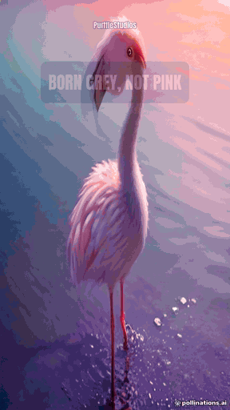
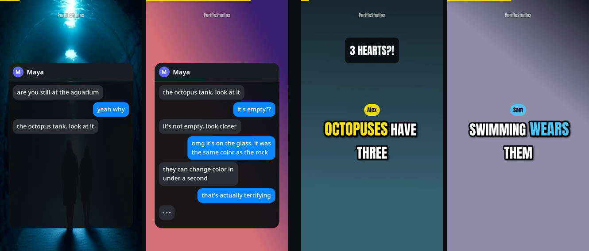
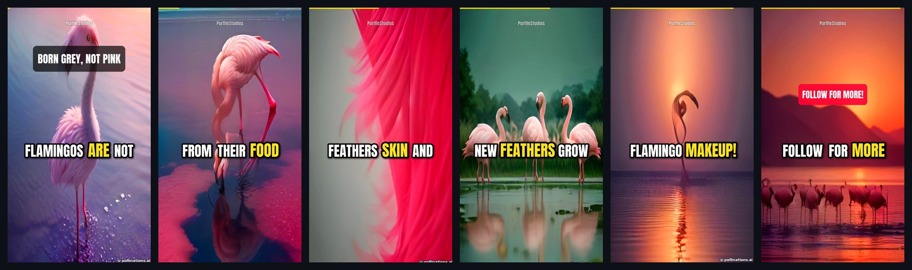
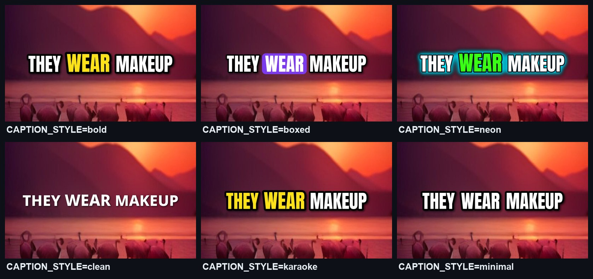
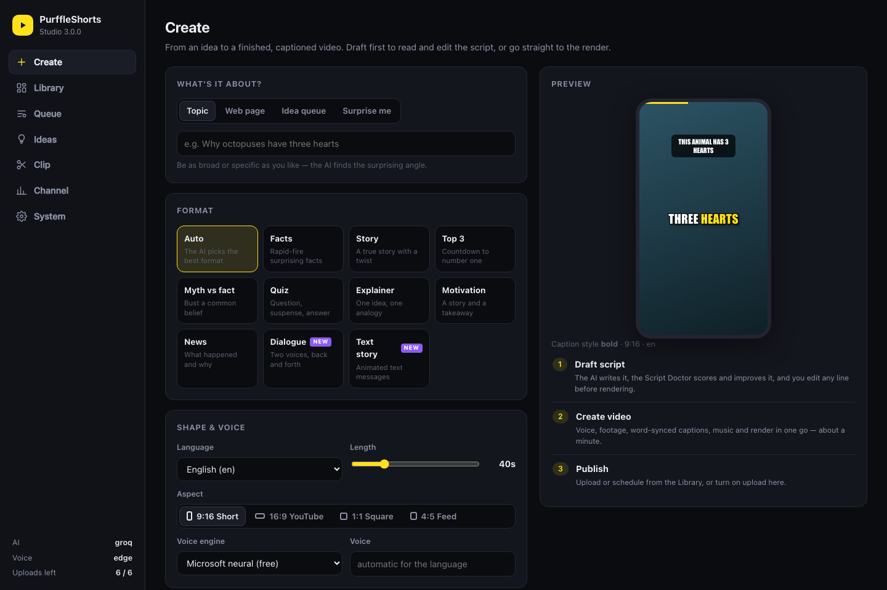
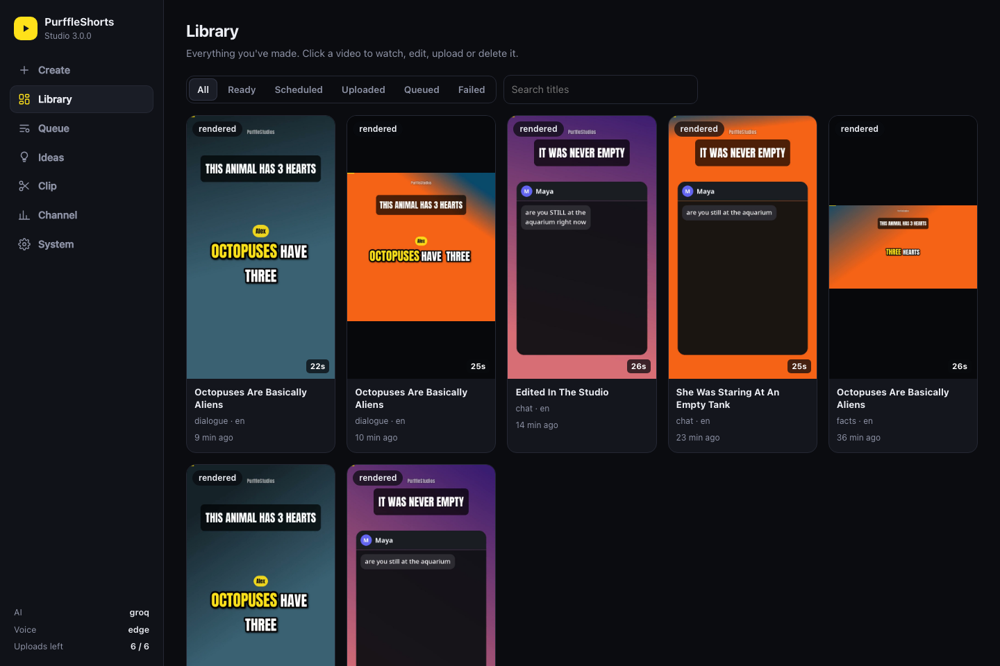
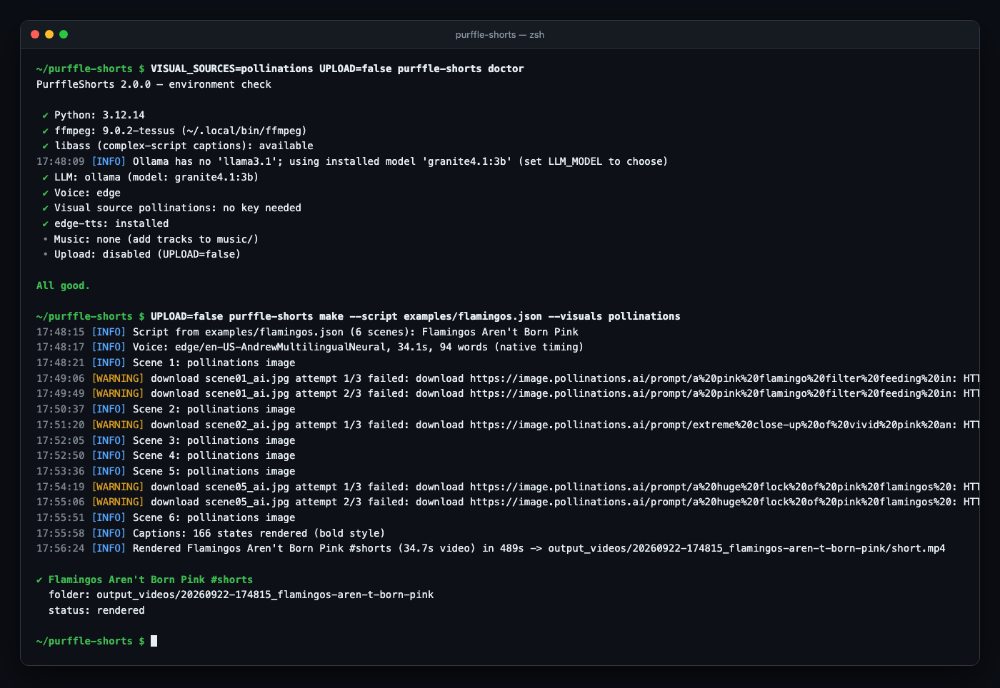
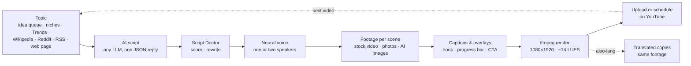

<div align="center">

# PurffleShorts — Free AI YouTube Shorts Generator & Upload Autopilot

**An open-source Python app that turns any topic, web page or long video into finished YouTube Shorts and publishes them for you.**<br>
It writes the script with the AI model you choose (GPT, Claude, Gemini, Llama through Ollama, DeepSeek, Grok, Mistral or any OpenAI-compatible API), has a second AI pass grade and rewrite it, voices it with free neural voices (one or two speakers), finds stock footage or AI images for every sentence, adds word-by-word animated captions or an animated text-message screen, renders with ffmpeg in 9:16, 16:9, 1:1 or 4:5, then uploads or schedules it on YouTube, on a loop. It also clips podcasts and talks into Shorts, plans your content calendar, and works from Claude Desktop through MCP.

[](https://github.com/Chamanrajragu/purffle-shorts/actions/workflows/ci.yml)
[](https://python.org)
[](LICENSE)
[](https://github.com/Chamanrajragu/purffle-shorts/stargazers)
<br>
[](#-ai-models)
[](#%EF%B8%8F-voices)
[](#-publishing--scheduling)
[](#-use-it-from-claude-and-other-ai-apps-mcp)

[Features](#-features) · [What's new in 3.0](#-whats-new-in-30) · [Quick start](#-quick-start) · [Formats](#-formats) · [Clip long videos](#%EF%B8%8F-clip-long-videos-into-shorts) · [AI models](#-ai-models) · [Voices](#%EF%B8%8F-voices) · [Publishing](#-publishing--scheduling) · [Studio](#%EF%B8%8F-studio-web-app) · [MCP](#-use-it-from-claude-and-other-ai-apps-mcp) · [CLI](#-command-line) · [FAQ](#-faq)



<sub>Real output: <code>purffle-shorts make --script examples/flamingos.json --visuals pollinations</code><br>
AI images from Pollinations, free Microsoft neural voice. 15-second excerpt of a 35-second Short (GIFs have no sound).<br>
Made in September 2026; Pollinations has since limited keyless use to about one image every few minutes (see <a href="#-captions--look">visual sources</a>).</sub>

### ⭐ Star this repo if you find it useful — it really helps! &nbsp;·&nbsp; 🌐 [**Live page → purffle.com/purffle-shorts**](https://purffle.com/purffle-shorts/)

</div>

---

## 🤖 What is PurffleShorts?

PurffleShorts is a **YouTube Shorts automation tool** for faceless channels. Start it and it keeps going: fresh topic, retention-focused script that a second AI pass reviews and tightens, natural AI voiceover, relevant footage, captions synced to each spoken word, a polished render, and an upload or scheduled release. It stays inside YouTube's daily API quota.

Beyond the autopilot, it is a small studio: draft a script and edit any line before rendering, make **two-voice dialogues** and **text-message stories**, turn an article into a Short, **clip a podcast into Shorts**, publish the same video in **several languages**, plan a week of ideas in one go, and let the channel's own view counts steer new scripts.

It is made for **content creators**, **faceless YouTube channels**, **educators** and **marketers** who want short-form video at volume without editing by hand. It runs on your own computer (macOS, Windows, Linux or Docker), you pick every model, and the vertical 9:16 MP4s work for **TikTok** and **Instagram Reels** too.

---

## ✨ Features

**AI scriptwriting**
- One structured LLM call returns the whole Short: hook, scenes, a footage search and an image prompt per scene, title, description, hashtags, tags and YouTube category.
- **Script Doctor**: a second AI pass scores the draft 0–100 for retention (hook, pacing, payoff, accuracy risk), lists what is weak and rewrites it. The score is stored with every video.
- **12 providers**: OpenAI, Anthropic Claude, Google Gemini, Groq, OpenRouter, DeepSeek, Mistral, Together AI, xAI Grok, Ollama, LM Studio, or any OpenAI-compatible URL, with automatic fallback to another provider.
- **10 formats**: facts, story, listicle, myth-busting, quiz, explainer, motivational, news, **two-voice dialogue** and **text-message story**.
- Draft first and edit any line in the Studio, or write a script yourself and render it with `--script`, with no LLM call.

**Sources**
- Your niches, Google Trends, Wikipedia "On this day", Reddit TIL, **RSS feeds**, your own list, **any web page** (`--url`) or **document** (`--from-file`).
- **Content planner**: the AI brainstorms a batch of specific, non-repeating ideas into a queue that the autopilot uses first.
- **Clip long videos**: transcribe a podcast, interview or talk, let the AI pick the moments that stand alone, and get captioned vertical clips.

**Voiceover**
- 320+ free Microsoft neural voices in 75 languages, with word-level timestamps. No key needed.
- Two speakers for dialogues and chat stories, each with their own voice, joined with natural pauses.
- **One video, many languages**: `--also-lang es,hi` adds translated copies that reuse the same footage.
- Also OpenAI TTS, ElevenLabs, Kokoro-82M, Coqui and the operating-system voice. Falls back to the free voice if a paid engine fails.

**Footage & images**
- A separate stock-footage search for every scene (Pexels, Pixabay), portrait clips preferred, smart 9:16 crop, never reused across videos.
- AI images per scene from OpenAI (gpt-image-1 / DALL·E 3) or Pollinations, or your own `media/` folder.
- Ken Burns motion on photos, colour grades, transitions.

**Captions & editing**
- Captions appear exactly when each word is spoken, with the current word highlighted. 6 styles; Latin, Indic, Arabic, Thai and CJK scripts.
- Dialogues get speaker name tags and a colour per speaker; chat stories get an animated phone screen with typing indicators.
- **9:16, 16:9, 1:1 or 4:5** output (`--aspect`), with captions and overlays sized for each shape.
- Hook title, watermark, progress bar, end call-to-action, background music that ducks under the voice, loudness normalised to −14 LUFS.
- One ffmpeg pass. No MoviePy, no ImageMagick, no GPU.

**Publishing**
- Uploads to YouTube, or schedules each video into your next free time slot.
- Quota-aware queue, AI-content disclosure, playlists, privacy, made-for-kids flag.
- Every video also gets a cover image, SRT subtitles and a metadata file for cross-posting.

**Workflow**
- Autopilot loop, one-off videos, bulk batches with parallel workers, several channels from separate settings files.
- **Studio web app**: create, draft and edit, watch every stage live, browse and play the library, plan ideas, clip videos, read channel stats.
- **MCP server**: ask Claude Desktop, Claude Code or Cursor to make, clip or upload videos.
- **Learns from your channel** (opt-in): view counts of your uploads show the AI what works for your audience.
- Discord / Slack / webhook notifications, a `doctor` self-check, SQLite history, Docker, and CI that renders real videos on every push.

---

## 📸 Screenshots

**New in 3.0: text-message stories and two-voice dialogues.** Rendered from [`examples/chat-story.json`](examples/chat-story.json) and [`examples/dialogue.json`](examples/dialogue.json).

<p align="center"></p>

**Frames from the Short above**: hook title, word-highlighted captions, progress bar, end call-to-action.

<p align="center"></p>

**Six caption styles**, drawn by the same renderer the videos use:

<p align="center"></p>

**Studio**, the local web app: pick a format, shape and look, then draft the script or create the video.

<p align="center"></p>

The library: every video with its format, language, length and status. Open one to play it, edit and re-render it, upload or delete it.

<p align="center"></p>

**Command line**: `doctor` checks the setup, `make` renders a Short.

<p align="center"></p>

---

## 🆕 What's new in 3.0

| | 2.0 | 3.0 |
|---|---|---|
| Script quality | One LLM call | **Script Doctor**: a second pass scores retention 0–100, lists the problems and rewrites weak lines. You can also draft first and edit every line in the Studio |
| Formats | 8, one narrator | **10**, including **two-voice dialogues** (name tags, colour per speaker) and **text-message stories** (animated phone screen, typing indicator) |
| Sources | Niches, Trends, Wikipedia, Reddit, your list | Also **any web page** (`--url`), **documents** (`--from-file`), **RSS feeds**, and an **AI content planner** with an idea queue |
| Long videos | — | **`clip`**: transcribe a podcast or talk, the AI picks self-contained moments, vertical crop or blurred fit, word captions |
| Languages | One per video | **`--also-lang es,hi`**: translated copies of the same video that reuse its footage |
| Shapes | 9:16 | **9:16, 16:9, 1:1, 4:5** with sizes that adapt (`--aspect`) |
| Channel feedback | — | **Learns from stats** (opt-in): the best and worst performers are shown to the AI when it writes |
| Web app | A form and a list | **New Studio**: live stage progress, script editor, library with player and actions, ideas, clipping, channel stats, setup checks. Works on phones |
| Integrations | — | **MCP server** for Claude Desktop, Claude Code and Cursor; Discord / Slack / webhook notifications |
| Reliability | | Clear errors for bad settings, hardware-encoder fallback to libx264, failed videos return their idea to the queue, database migrates itself, 110+ tests |

<details>
<summary><b>What changed in 2.0</b> (the rewrite from 1.x)</summary>

Version 2 is a rewrite. The 1.x pipeline had problems: the pinned `openai` SDK no longer had the API the code called, landscape footage was stretched into portrait, captions were evenly spaced rather than following the voice, the title and description were generated separately from the script, and every video went through six MoviePy re-encodes.

| | 1.x | 2.0 |
|---|---|---|
| Script | GPT-3.5, 4 separate calls, title unrelated to script | **One structured call**: hook, scenes, per-scene footage queries, title, description, hashtags, tags, category |
| Models | OpenAI only | **OpenAI, Claude, Gemini, Groq, OpenRouter, DeepSeek, Mistral, Together, xAI, Ollama, LM Studio, any OpenAI-compatible URL**, with automatic fallbacks |
| Voice | Coqui Tacotron2 (robotic, heavy) | **Free Microsoft neural voices** (320+, 75 languages) + OpenAI, ElevenLabs, Kokoro, Coqui, system voice |
| Captions | Even time slices, no sync | **Word-accurate timing**, active-word highlight, pop-in animation, 6 styles |
| Footage | Same query for every clip, landscape stretched to 9:16 | **A search per scene**, portrait-first, smart 9:16 crop, never reused across videos, Ken Burns on photos, AI images optional |
| Render | MoviePy + ImageMagick, 6 encodes at 60 fps | **ffmpeg only**, one final encode, transitions, colour grades, progress bar. A 25 s Short rendered in 30–40 s on an Intel Mac in testing |
| Audio | Music at a fixed volume | **Music auto-ducks under the voice**, loudness normalised to −14 LUFS |
| Publishing | Always public, burns quota | **Schedule into time slots**, privacy options, AI-content disclosure, playlists, quota-aware queue |
| Ideas | 22 hard-coded categories, repeats | **Niches, Google Trends, Wikipedia "On this day", Reddit TIL, your own list**, with repeats prevented |
| Extras | — | Web dashboard, `doctor` self-check, history DB, SRT subtitles, cover image, `--script` for your own scripts, Docker, CI with an offline end-to-end render test |

</details>

---

## 🔄 How it works



| Step | What happens |
|------|-------------|
| 1. **Topic** | Queued ideas first, then your niches, today's Google Trends, Wikipedia "On this day", Reddit TIL (best-effort, since Reddit rate-limits anonymous requests) or `topics.txt`, skipping anything already made and news about deaths, violence or elections |
| 2. **Script** | The LLM writes a hook-first script split into scenes, each with its own stock-footage query and AI-image prompt, plus title, description, hashtags, tags and category, all in one JSON reply. With `LEARN_FROM_STATS`, your best and worst performers are part of the prompt |
| 3. **Review** | The Script Doctor scores it for retention and rewrites weak lines (`SCRIPT_REVIEW=rewrite`, the default). A rewrite that misses the target length is ignored, and a failed review never fails the video |
| 4. **Voice** | Neural TTS speaks the script and returns per-word timestamps (or they are aligned/estimated). Dialogues and chats are voiced line by line with two voices |
| 5. **Footage** | Each scene gets its own clip: Pexels / Pixabay video (portrait preferred), photos with Ken Burns motion, your own `media/` folder, or AI images, with an animated gradient as the last resort |
| 6. **Captions** | 2–3-word captions appear exactly when spoken, with the current word highlighted; chat stories show messages popping in on a phone screen instead |
| 7. **Render** | Scenes are cover-cropped to the output shape, colour-graded and joined with transitions; hook title, watermark, progress bar, end CTA, ducked music and −14 LUFS loudness are added in one ffmpeg pass |
| 8. **Publish** | Uploaded now, or scheduled into your next free time slot, with the synthetic-media disclosure set; queued automatically when the daily quota is used up |

---

## 🚀 Quick start

**Needs:** Python 3.10+. ffmpeg is used if installed; if not, the bundled `imageio-ffmpeg` binary is used. ImageMagick is no longer needed.

```bash
git clone https://github.com/Chamanrajragu/purffle-shorts.git
cd purffle-shorts
python -m venv venv && source venv/bin/activate      # Windows: venv\Scripts\activate
pip install -e .                                     # or: pip install -r requirements.txt
```

**1. See it work with no keys at all.** This renders a sample Short with a built-in script, a free neural voice and generated backgrounds:

```bash
python -m purffle_shorts demo
python -m purffle_shorts demo --style chat        # text-message story
python -m purffle_shorts demo --style dialogue    # two voices
```

Or open the web app and click through it (demo mode is on until you add a key):

```bash
python -m purffle_shorts studio
```

**2. Configure.** Copy `.env.example` to `.env`, add **one** LLM key (or run Ollama) and a Pexels and/or Pixabay key (both free), then run the self-check:

```bash
python -m purffle_shorts doctor
```

**3. Make one video** (kept locally, not uploaded):

```bash
python -m purffle_shorts make --topic "why octopuses have three hearts" --no-upload
```

**4. Connect YouTube once.** Create an OAuth client of type *Desktop app* in Google Cloud Console with the YouTube Data API v3 enabled, save it as `credentials.json`, then:

```bash
python -m purffle_shorts auth
```

**5. Autopilot:**

```bash
python -m purffle_shorts plan --count 14   # optional: queue two weeks of ideas first
python -m purffle_shorts run               # or the old way:  python YT.py
```

**Optional extras:** `pip install -e ".[clip]"` adds faster-whisper and yt-dlp for [clipping long videos](#%EF%B8%8F-clip-long-videos-into-shorts).

---

## 💬 Formats

Pick one with `SCRIPT_STYLE` / `--style`, or leave it on `auto`.

| Format | What you get |
|---|---|
| `facts` · `story` · `listicle` · `myth` · `quiz` · `explainer` · `motivational` · `news` | One narrator, footage per scene, word-highlighted captions |
| `dialogue` | Two people talking: A asks or doubts, B answers with specifics. Each line is voiced with its own voice (`TTS_VOICE` and `TTS_VOICE_B`, or automatic), captions carry the speaker's name and colour |
| `chat` | A text-message story: messages pop into a phone screen as they are read aloud, the contact's replies get a typing indicator, the chat scrolls when it fills up. Each side has its own voice |

```bash
purffle-shorts make --style chat --topic "a babysitter gets texts from an unknown number"
purffle-shorts make --style dialogue --topic "why the sky is blue"
```

Scripts from the LLM are fiction for `chat` (the prompt forbids real people). As with every format, read before you publish.

---

## ✂️ Clip long videos into Shorts

```bash
pip install faster-whisper                          # free, local transcription (or set OPENAI_API_KEY)
purffle-shorts clip podcast.mp4 --count 3           # fill the frame
purffle-shorts clip talk.mp4 --count 5 --crop blur  # whole picture over a blurred copy
purffle-shorts clip "https://…" --count 3           # URLs need: pip install yt-dlp
```

The video is transcribed with word timings, and the LLM reads the timestamped transcript and picks moments of 20–58 s (`--min-seconds`, `--max-seconds`) that open with a hook and end on a complete thought, with a title, hashtags and a retention score for each. Each clip is cut on sentence boundaries, cropped to 9:16, captioned word by word with a hook title, and loudness-normalised. Without an LLM it still works, with evenly spaced moments instead. Only clip videos you own or have permission to reuse.

---

## 🗓️ Ideas, sources and languages

- **Plan ahead:** `purffle-shorts plan --count 14 --niche "space"` asks the AI for specific, non-repeating ideas with a format and an angle each. `ideas` lists the queue (`--add`, `--remove`, `--clear`). Queued ideas are always made first; if a video fails, its idea goes back in the queue.
- **From a web page or document:** `make --url https://…` or `make --from-file notes.md` uses the text as the script's source material.
- **RSS:** `RSS_FEEDS=https://…/feed.xml,https://…` and `TOPIC_SOURCES=niche:3,rss:1`.
- **Many languages:** `ALSO_LANGUAGES=es,hi` (or `--also-lang`) makes a translated copy of every video with a native voice, reusing the original's footage. Each copy is its own upload, linked to the original in the library.

---

## 📊 Learn from your channel

```bash
LEARN_FROM_STATS=true
YOUTUBE_API_KEY=...        # optional: reads public stats without asking for more OAuth access
```

`purffle-shorts stats` (and the Studio's Channel page) reads view, like and comment counts of the videos PurffleShorts uploaded: one API unit per 50 videos. With `LEARN_FROM_STATS=true` the autopilot refreshes them twice a day and shows the LLM your best and worst performers (public for 48 hours or more) when it writes and plans. Without `YOUTUBE_API_KEY`, run `auth` once more to grant read access.

---

## 🧠 AI models

Set `LLM_PROVIDER` and `LLM_MODEL` in `.env`, or pass `--provider` / `--model`. With `LLM_PROVIDER=auto` the first key found is used, and a running Ollama is used when there is no key. `LLM_FALLBACKS=anthropic,gemini` retries with other providers when the main one fails. Any model a provider offers works; the defaults are only starting points.

| Provider | `LLM_PROVIDER` | Key | Default model |
|---|---|---|---|
| OpenAI | `openai` | `OPENAI_API_KEY` | `gpt-4o-mini` (GPT-5 / o-series supported) |
| Anthropic Claude | `anthropic` | `ANTHROPIC_API_KEY` | `claude-opus-5` (structured JSON output) |
| Google Gemini | `gemini` | `GEMINI_API_KEY` | `gemini-2.5-flash` |
| Groq | `groq` | `GROQ_API_KEY` | `llama-3.3-70b-versatile` |
| OpenRouter | `openrouter` | `OPENROUTER_API_KEY` | `openai/gpt-4o-mini`, or any of its hundreds of models |
| DeepSeek | `deepseek` | `DEEPSEEK_API_KEY` | `deepseek-chat` |
| Mistral | `mistral` | `MISTRAL_API_KEY` | `mistral-small-latest` |
| Together AI | `together` | `TOGETHER_API_KEY` | `meta-llama/Llama-3.3-70B-Instruct-Turbo` |
| xAI | `xai` | `XAI_API_KEY` | `grok-3-mini` |
| Ollama (local, free) | `ollama` | — | `llama3.1`, or the first model you have pulled |
| LM Studio (local, free) | `lmstudio` | — | whatever is loaded |
| Anything OpenAI-compatible | `custom` | `LLM_API_KEY` + `LLM_BASE_URL` | `LLM_MODEL` |

`python -m purffle_shorts providers` shows which providers have a key and whether Ollama / LM Studio are running.

**Script Doctor** (`SCRIPT_REVIEW`): `rewrite` (default) scores every script and uses the improved version, `score` only records the score and the problems, `off` skips the extra call (`--no-review`). It adds one LLM call per video.

> **Facts need a capable model.** In testing, a 3B local model wrote a confident but wrong claim ("flamingos get their colour from carrots"). Use a larger model for fact-based formats, or check `script.json`, fix it, and re-render with `--script`.

---

## 🎙️ Voices

| Engine | `TTS_ENGINE` | Cost | Word timing |
|---|---|---|---|
| Microsoft neural voices (edge-tts) | `edge` *(default)* | Free, no key | Native |
| OpenAI `gpt-4o-mini-tts` / `tts-1-hd` | `openai` | Paid | Aligned or estimated |
| ElevenLabs | `elevenlabs` | Paid | Native |
| Kokoro-82M (open weights, local) | `kokoro` | Free, `pip install kokoro soundfile` | Aligned or estimated |
| Coqui TTS (local) | `coqui` | Free, `pip install coqui-tts` | Aligned or estimated |
| OS voice (`say` / espeak-ng / SAPI) | `system` | Free, offline | Estimated |

- `python -m purffle_shorts voices --lang en` lists every free voice (322 voices in 75 languages when checked). Set `TTS_VOICE=en-US-GuyNeural`, or a comma list to rotate voices between videos.
- `LANGUAGE=es` (or `hi`, `ta`, `fr`, `pt`, `ja`, …) switches the script, the voice and the caption font together. Tamil, Hindi, Arabic, Thai and similar scripts are rendered through libass so they are shaped correctly.
- `pip install faster-whisper` gives precise word timing for engines without native timestamps (`ALIGN=auto`).
- The second speaker in dialogues and chats uses `TTS_VOICE_B`, or a contrasting voice picked for the language.
- If the chosen engine fails, the video falls back to the free edge voice instead of failing.

---

## 🎨 Captions & look

| Setting | Options |
|---|---|
| `CAPTION_STYLE` | `bold` (yellow active word) · `boxed` (active word in a colour box) · `neon` (glow) · `clean` · `karaoke` · `minimal` |
| `CAPTION_POSITION` | `upper` · `center` · `lower` |
| `COLOR_GRADE` | `none` · `vivid` · `cinematic` · `warm` · `cool` · `bw` |
| `TRANSITION` | `random` · `none` · `fade` · `slideup` · `smoothleft` · `circleopen` · `zoomin` · … |
| Overlays | Hook title (`HOOK_OVERLAY`), watermark (`WATERMARK`, defaults to `CHANNEL_NAME`), progress bar (`PROGRESS_BAR`), end call-to-action (`END_CTA`) |
| Music | Drop tracks in `music/` (a random one is picked per video; `back.mp3` still works); `MUSIC_VOLUME`, `MUSIC_DUCKING` |
| Shape | `ASPECT=9:16` (Shorts, Reels, TikTok) · `16:9` (regular YouTube video, no `#shorts`) · `1:1` · `4:5`, or an exact `RESOLUTION=1080x1920` |
| Output | `FPS=30`, `VIDEO_ENCODER=libx264` · `h264_videotoolbox` (Mac) · `h264_nvenc` (NVIDIA) · `auto` (a hardware encoder that fails falls back to libx264) |

The caption font is downloaded once from Google Fonts (Anton for Latin scripts, Noto Sans for other scripts). Set `CAPTION_FONT=/path/font.ttf` to use your own.

**Visual sources** (`VISUAL_SOURCES`, tried in order per scene): `pexels`, `pixabay`, `local` (your `media/` folder, matched by filename keywords), `openai-images` (gpt-image-1 / DALL·E 3), `pollinations` (AI images). Searches and AI images follow the output shape (portrait, landscape or square).

> **Pollinations without a key is no longer practical for whole videos.** Tested on 29 September 2026: the first request returned an image, the next ones answered HTTP 402 "payment required", roughly one image every few minutes. When that happens PurffleShorts stops asking for the rest of that video and those scenes fall back to the next source. `POLLINATIONS_API_KEY` is sent as a Bearer token for keyed access; that path has not been tested here. Pexels and Pixabay keys are free and are the dependable choice.

---

## 📅 Publishing & scheduling

- `YT_PRIVACY=public|unlisted|private`.
- `PUBLISH_TIMES=09:00,14:00,19:00` with `TIMEZONE=Asia/Kolkata` uploads each video as private and schedules it into the next free slot. Render in bulk, release on schedule.
- **Quota-aware.** An upload costs 1,600 of the default 10,000 daily API units, so `YT_DAILY_LIMIT=6`. Extra videos are queued and uploaded after the quota resets at midnight Pacific time. On autopilot the queue is drained first, and production waits instead of piling up.
- `SYNTHETIC_MEDIA=true` sets YouTube's *altered or synthetic content* disclosure. `MADE_FOR_KIDS`, `PLAYLIST_ID` and category (chosen by the AI) are set too.
- Each video's folder holds `short.mp4` (`video.mp4` for 16:9), `cover.jpg`, `captions.srt`, `script.json` and `metadata.json` (including the retention score), ready to cross-post to TikTok or Reels. `KEEP_VIDEOS=false` deletes the MP4 after a successful upload.
- **Notifications:** `NOTIFY_WEBHOOK=https://discord.com/api/webhooks/…` (or a Slack incoming webhook, or any URL for JSON) posts a message when a video is rendered, uploaded, scheduled, queued or fails.

---

## 💻 Command line

```bash
python -m purffle_shorts <command> [options]        # or `purffle-shorts <command>` after pip install
```

| Command | What it does |
|---|---|
| `run` | Autopilot loop. `--count N`, `--once`, `--batch`, `--workers`, `--delay` |
| `make` | Make one video now. `--topic "…"`, `--url https://…`, `--from-file notes.md`, `--count N`, `--script file.json` (your own script, no LLM) |
| `demo` | Render a sample with no API keys (`--style chat` / `dialogue` for the conversation formats) |
| `clip` | Cut a long video into Shorts: `clip talk.mp4 --count 3 --crop center\|blur` |
| `plan` / `ideas` | Let the AI plan ideas into the queue / list, add or remove queued ideas |
| `stats` | Refresh and show view counts of your uploads |
| `mcp` | Run as an MCP server for Claude Desktop, Claude Code, Cursor… |
| `upload` | `--pending` uploads everything not yet on YouTube; `--id N` uploads one |
| `auth` | Connect your YouTube channel |
| `doctor` | Check ffmpeg, LLM (including whether the Ollama model is pulled), keys, fonts, YouTube setup |
| `providers` / `voices` | List LLM providers / free voices |
| `history` | Everything made so far, with links |
| `studio` | Local web app |

Common options: `--source queue|trending|wikipedia|reddit|rss|file|niche`, `--niche "space"`, `--style facts|story|listicle|myth|quiz|explainer|motivational|news|dialogue|chat`, `--lang`, `--duration 45`, `--aspect 9:16|16:9|1:1|4:5`, `--also-lang es,hi`, `--provider`, `--model`, `--no-review`, `--tts`, `--voice`, `--voice-b`, `--visuals`, `--caption-style`, `--grade`, `--transition`, `--resolution`, `--no-music`, `--no-upload`, `--privacy`, `--publish-times`, `--env-file`.

**Your own script:** every video folder has a `script.json`. Edit the narration, title or image prompts and render it again with `make --script path/to/script.json`. The files in [`examples/`](examples) show the format.

**Several channels:** keep one settings file per channel (niche, voice, `YT_TOKEN_FILE`, `DATA_DIR`) and run `python -m purffle_shorts run --env-file .env.channel2`.

**Upgrading from 1.x:** `python YT.py`, `--once`, `--no-upload`, `--count N` and the old `SHORTS_*` variables still work, and `token.pickle` is migrated to `token.json` automatically. Install the new requirements first.

---

## 🖥️ Studio (web app)

```bash
python -m purffle_shorts studio        # opens http://127.0.0.1:8765
```

- **Create:** topic, web page, idea queue or "surprise me"; ten formats; language, length, aspect, voices, caption style (with a preview), grade, transitions, footage sources, model, Script Doctor mode, extra languages, upload.
- **Draft, then edit:** the AI writes and reviews the script, you see the retention score and the problems it found, change any line, reorder or add scenes, switch speakers, then render exactly that script.
- **Live progress** through topic, script, review, voice, footage, captions, render and upload, with the log.
- **Library:** thumbnails with status, format, language and score; open one to play it, download the MP4 or captions, upload it, edit and re-render it, or delete it.
- **Ideas, Clip, Channel and System** pages: plan and queue ideas, clip long videos, see views per video and per format, run the setup checks and copy the MCP config.

It needs no build step or internet connection (no CDN), listens on localhost only, refuses requests for any other host name, sends a strict Content-Security-Policy, and every action needs a per-session token.

---

## 🤖 Use it from Claude and other AI apps (MCP)

PurffleShorts is an [MCP](https://modelcontextprotocol.io) server too. Add it to Claude Desktop, Claude Code, Cursor or any MCP client:

```json
{
  "mcpServers": {
    "purffle-shorts": {
      "command": "purffle-shorts",
      "args": ["mcp"],
      "env": { "PURFFLE_HOME": "/path/to/your/purffle/folder" }
    }
  }
}
```

`PURFFLE_HOME` is the folder with your `.env`. Then ask things like *"make a 30-second text story about a haunted smart speaker, in Spanish"*, *"draft a dialogue about black holes and show me the script first"*, *"clip my interview.mp4 into three Shorts"* or *"plan ten ideas about ancient Rome"*. Tools: `make_short`, `draft_script`, `clip_video`, `plan_ideas`, `list_videos`, `upload_video`. Nothing is uploaded unless the request says so (`upload: true`); `demo: true` works without any keys.

---

## 🐳 Docker

```bash
docker build -t purffle-shorts .
docker run --rm -it --env-file .env -v "$PWD:/work" purffle-shorts run
```

Run `auth` once on your own computer so `token.json` exists in the mounted folder.

---

## ❓ FAQ

**Is PurffleShorts free?**<br>
Yes. It is MIT-licensed and runs on your own computer. The default voices, Ollama models, faster-whisper and the Pexels and Pixabay APIs cost nothing. You only pay for paid APIs you choose to use, such as OpenAI, Claude or ElevenLabs. The Script Doctor adds one LLM call per video (`SCRIPT_REVIEW=off` to skip it).

**Can it make text-message stories or two-person conversations?**<br>
Yes: `--style chat` renders an animated phone screen with messages popping in as each side's voice reads them, and `--style dialogue` voices two people with name tags on the captions.

**Can it turn my podcast or stream into Shorts?**<br>
Yes: `purffle-shorts clip episode.mp4 --count 5`. It needs faster-whisper (free, local) or an OpenAI key for the transcript.

**Can I use it from Claude Desktop or Cursor?**<br>
Yes, it is an MCP server: see [Use it from Claude and other AI apps](#-use-it-from-claude-and-other-ai-apps-mcp).

**Can I try it without an API key?**<br>
Yes. `python -m purffle_shorts demo` renders a sample Short with no keys. With [Ollama](https://ollama.com) installed, `make` writes scripts with a local model, also without a key.

**Does it work with ChatGPT, Claude, Gemini, DeepSeek or Llama?**<br>
Yes: OpenAI GPT models (including GPT-5 and the o-series), Anthropic Claude, Google Gemini, DeepSeek, Mistral, xAI Grok, Llama through Groq, Together AI, Ollama or LM Studio, hundreds more through OpenRouter, and any OpenAI-compatible endpoint.

**Can it post to TikTok or Instagram Reels?**<br>
It uploads to YouTube only. Every video is a standard MP4 (9:16, or 1:1 / 4:5 for feeds) with a cover image, subtitles and metadata, so you can post the same file to TikTok and Reels yourself.

**How many Shorts can it upload per day?**<br>
Six by default (`YT_DAILY_LIMIT`), sized to YouTube's default API quota. It can render more than that; extra videos wait in a queue and upload after the quota resets.

**Can I write or fix the script myself?**<br>
Yes. Edit any video's `script.json` (or write one like [`examples/flamingos.json`](examples/flamingos.json)) and run `make --script file.json`.

**Which languages are supported?**<br>
Set `LANGUAGE` (for example `es`, `hi`, `ta`, `ar`, `ja`) and the script, voice and caption font follow. The free voices cover 75 languages. `ALSO_LANGUAGES=es,hi` publishes every video in those languages too.

**Do I need a GPU?**<br>
No. Rendering uses ffmpeg on the CPU. A GPU only speeds up optional local models (Ollama, Kokoro, faster-whisper).

**Is automated uploading allowed?**<br>
It uses the official YouTube Data API with your own Google sign-in, and sets YouTube's synthetic-content disclosure for you. You are responsible for what you publish: review the videos and follow YouTube's policies, including its monetisation rules on mass-produced, repetitive content.

---

## 🏗️ Tech stack

| Component | Technology |
|---|---|
| Script | Any LLM: OpenAI-compatible HTTP, plus the Anthropic SDK with structured outputs; a review pass and translation on the same providers |
| Voice | edge-tts, OpenAI, ElevenLabs, Kokoro, Coqui, OS voices; multi-speaker joining; optional faster-whisper alignment |
| Video | ffmpeg (xfade, zoompan, sidechaincompress, loudnorm, libass), Pillow caption and chat renderers |
| Media | Pexels, Pixabay, local files, OpenAI Images, Pollinations; yt-dlp for clipping from URLs |
| Upload | YouTube Data API v3, OAuth 2.0, resumable uploads, view statistics |
| Studio | Python standard-library HTTP server, vanilla JS/CSS, no build step |
| Agents | MCP over stdio (standard library, no SDK) |
| State | SQLite history (videos, topics, clips, uploads, schedule, idea queue, stats), migrated automatically |

---

## 📁 Project structure

```
purffle-shorts/
├── YT.py                    # 1.x-compatible entry point (python YT.py)
├── purffle_shorts/
│   ├── cli.py               # commands: run, make, demo, clip, plan, ideas, stats, upload, auth, doctor, studio, mcp
│   ├── pipeline.py          # topic → script → review → voice → footage → render → upload → translations
│   ├── llm.py               # 12 LLM providers + fallback chain
│   ├── script.py            # prompt, JSON schema, Script Doctor, translation, clean-up, offline writer
│   ├── planner.py           # AI content planner → idea queue
│   ├── clipper.py           # long video → transcript → best moments → captioned clips
│   ├── tts.py               # voice engines, two-speaker joining, word alignment
│   ├── timing.py            # word timing, scene timeline, caption chunks, SRT
│   ├── media.py             # Pexels / Pixabay / local / AI images, de-duplication
│   ├── overlays.py          # captions (Pillow + libass), chat screen, hook, watermark, CTA, fonts
│   ├── render.py            # ffmpeg segments, transitions, grading, audio mix
│   ├── youtube.py           # OAuth, upload, scheduling, quota
│   ├── analytics.py         # view counts → what the LLM learns from
│   ├── notify.py            # Discord / Slack / webhook messages
│   ├── topics.py            # idea queue, niches, Trends, Wikipedia, Reddit, RSS, web pages, documents
│   ├── history.py           # SQLite history + migrations
│   ├── doctor.py            # setup checks (CLI and Studio)
│   ├── mcp_server.py        # MCP server over stdio
│   ├── studio.py            # local web app server + JSON API
│   └── web/                 # the Studio's HTML, CSS and JS
├── examples/                # ready-to-render scripts (make --script examples/flamingos.json)
├── tests/                   # unit + offline end-to-end render tests
├── docs/                    # screenshots
├── .env.example             # every setting, documented
├── Dockerfile
└── output_videos/           # renders (gitignored)
```

---

## 🛠️ Troubleshooting

| Problem | Fix |
|---|---|
| `No LLM is configured` | Add one key to `.env` (or start Ollama), then run `doctor` |
| `ollama model '…' is not pulled` | `ollama pull <model>`, or leave `LLM_MODEL` empty to use a model you already have |
| Every scene is a gradient | Add `PEXELS_API_KEY` / `PIXABAY_API_KEY` (both free) or put clips in `media/` |
| Pollinations returns HTTP 402 | Keyless use is now limited to about one image every few minutes. PurffleShorts skips it for the rest of that video; set `POLLINATIONS_API_KEY` or use Pexels/Pixabay |
| `clip` says it needs a transcript | `pip install faster-whisper` (or set `OPENAI_API_KEY`); URLs also need `pip install yt-dlp` |
| `Setting problem: X='…'` | A number setting in `.env` has a typo; the message names it and its default |
| `YouTube is not authorized` | Run `python -m purffle_shorts auth` |
| Videos stay `queued` | The daily quota is used up; they upload after midnight Pacific. Run `upload --pending` to retry now |
| A video failed and the log is too short | Run with `-v` for full tracebacks (also written to `data/logs/purffle.log`) |
| Wrong-looking non-Latin captions | Install an ffmpeg with libass (Homebrew and apt builds include it); `doctor` shows whether yours has it |

---

## 🤝 Contributing

Bug reports, ideas and pull requests are welcome. See [CONTRIBUTING.md](CONTRIBUTING.md) for the dev setup (tests run offline and render a real video), and [CHANGELOG.md](CHANGELOG.md) for what changed.

---

## ⚠️ Disclaimer

> This is an open-source automation tool for educational purposes. It needs your own API keys. Review AI-generated content before publishing, keep the synthetic-media disclosure on, and follow YouTube's Terms of Service and Community Guidelines. Not affiliated with YouTube, OpenAI, Anthropic, Google, Microsoft, Pexels, Pixabay or Pollinations.

---

<div align="center">

**Built by [Chaman Raj](https://github.com/Chamanrajragu)**

Part of the **Purffle** ecosystem — PurffleTools · PurffleAI · [Purffle.com](https://purffle.com)

</div>


---

<!-- purffle-ecosystem -->
## 🧩 The Purffle toolset

**PurffleShorts** is part of **[Purffle](https://purffle.com)** — a growing set of free, open-source tools built in the open. **If this saved you time, please drop a ⭐ — it genuinely helps the project reach more people!**

| Tool | What it does |
|------|--------------|
| 🔄 **[Claude Multi](https://github.com/Chamanrajragu/claude-multi)** | Run Claude Code with multiple accounts — auto-switch on the 5-hour limit |
| 📐 **[Purffle Chartwright](https://purffle.com/purffle-chartwright/)** | Desktop chart analysis where the AI cannot invent a price |
| 🎵 **[PurffleGrab](https://github.com/Chamanrajragu/purffle-grab)** | Free Spotify & YouTube downloader — MP3, MP4, 4K |
| 🎥 **[PurffleVision](https://github.com/Chamanrajragu/purffle-vision)** | AI video creation — any topic to a finished video |
| ⚡ **[PurffleShorts](https://github.com/Chamanrajragu/purffle-shorts)** 👈 | Autonomous YouTube Shorts generator |
| 📈 **[PurffleTrader](https://github.com/Chamanrajragu/purffle-trader)** | Crypto paper-trading bot — Binance, EMA + RSI |
| 🤖 **[PurffleCopyBot](https://github.com/Chamanrajragu/purffle-copybot)** | Copy-trading bot — mirror top Hyperliquid traders |

<sub>🌐 [purffle.com](https://purffle.com) · 💼 by [Chaman Raj](https://github.com/Chamanrajragu) · ⭐ Star to support open-source</sub>

<sub>Keywords: youtube shorts generator, faceless youtube automation, ai shorts maker, auto upload shorts, content automation, text message story video, fake chat story generator, podcast to shorts, long video to shorts clipper, ai video editor, mcp server</sub>

---

## Need Something Like This Built for You?

I wrote this. I also write Python for other people — fixed price, agreed before I start.

- **Python automation** — batch file processing, Excel/CSV cleaning, API pulls, scheduled reports, packaged as a `.exe` if you do not use Python · *1–5 days*
- **Web scraping** — clean data as Excel, CSV, JSON or Sheets, plus the reusable scraper · *1–4 days*
- **Custom AI chatbots** — trained on your own docs, full source code, no monthly fee · *2–7 days*
- **Excel and Google Sheets** — formulas, dashboards, macros, Apps Script · *1–4 days*

I only take work I can verify myself before delivering it — I run it on your real data first.

[](https://www.fiverr.com/purffle)
[](mailto:info@purffle.com)

More of what I have built: [purffle.com](https://purffle.com) · [purffle.tools](https://purffle.tools) · [purffleai.com](https://purffleai.com) · [purfflestudios.com](https://purfflestudios.com)
